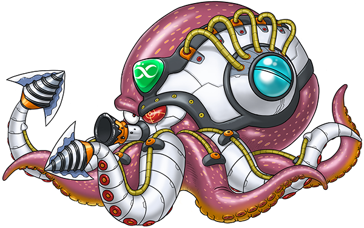
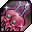

# BID 4 - Kraken
---

## Drops

### List
| Icon | Name |
| - | - |
|  | Neckplace | 
|  | Earring | 
|  | Ring | 

### Ring Combos
| Item 1 | Item 2 | Combo |
| - | - | - |
| **13%** Physical Reflect   **56** Dodge Rate | Increases Focus by **17**   **30** Hit Rate  | Increases properties by **13** |
| **13%** Physical Reflect   **10** LP Regeneration | Increases Soul by **17**   **30** Hit Rate  | Increases properties by **13** |
| **13%** Physical Reflect   **30** Resistance Rate | Increases Energy by **17**   **30** Hit Rate  | Increases properties by **13** |
| **15%** Energy Reflect   **30** Resistance Rate | Increases Constitution by **17**   **30** Hit Rate  | Increases properties by **13** |
| **15%** Energy Reflect   **10** LP Regeneration | Increases Strength by **17**   **30** Hit Rate  | Increases properties by **13** |
| **15%** Energy Reflect   **56** Dodge Rat | Increases Dexterity by **17**   **30** Hit Rate  | Increases properties by **13** |

### Video
<iframe src="https://www.youtube.com/embed/6AtOcxZI6ZU?si=FXeMr1G7Lstgft8R" title="YouTube video player" frameborder="0" allow="accelerometer; autoplay; clipboard-write; encrypted-media; gyroscope; picture-in-picture; web-share" referrerpolicy="strict-origin-when-cross-origin" allowfullscreen></iframe>