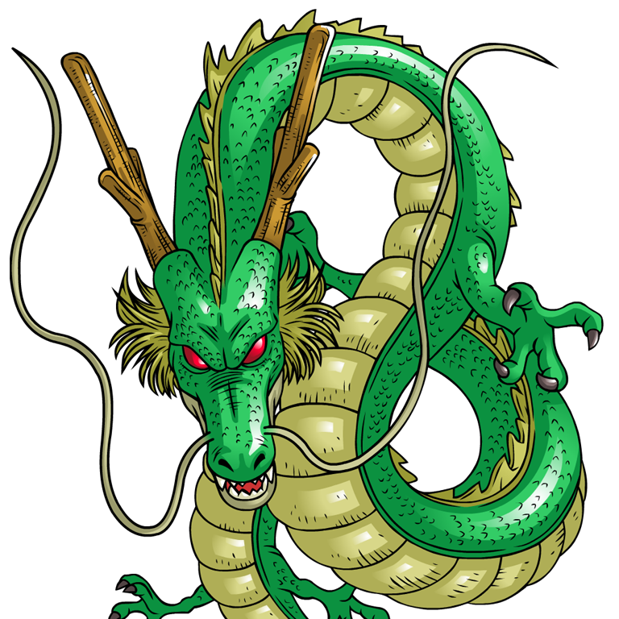
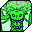
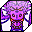

# Dragon Balls
---

In Age 996 Dende created many weaker sets of Dragon Balls so that young warriors could grow stronger by competing for them. Collect all seven of a set, bring them to a **Dragon Shrine** (Shenron altar) and Shenron grants **one wish**.

## Dragon Ball Sets

| Icon | Set | How to get it | Wishes |
| - | - | - | - |
|  | Quest Dragon Balls (black background) | Quest rewards between levels 5 and 20 | One fixed reward, once per character |
|  | Hunt Dragon Balls | Dropped by monsters during the Dragon Ball Hunt event | Full wish list |
| | Scramble Dragon Balls | Won in the Dragon Ball Scramble PvP event, level 45+ | Level 55 items |

The sets cannot be mixed: quest balls do not combine with hunted balls.

## Quest Dragon Balls (Level 5–20)

Each race collects its first set through quests in its own starting zone. The quests unlock one by one as you level.

| Ball | Level | Human | Namekian |
| - | - | - | - |
|  | 5 | Goods Merchant | A Namekian villager |
|  | 7 | Pig NPC | A Majin NPC |
|  | 9 | Police Dog NPC, who sends you to a Capsule Corp. girl | Chain starting with "kill 7 Red Pants dogs", finishing at Azusa Watchtower Village |
|  | 12 | Red Pants Bull NPC, after a short chain with the Roshi look-alike NPC | The Namekian in front of Dragon Cave |
|  | 14 | Turtle NPC | Namekian Healer |
|  | 17 (Namekian: 16) | Farmer NPC, then the Majin standing next to him | The Namekian in front of the map revealer: kill 9 Putrid Saibamen, then 7 snakes and the King Snake |
|  | 20 | Engineer Expert NPC, then the Hippo entertainer NPC | Grand Elder |

Majins follow the same level steps in their own starting zone. The seventh ball is tied to the dungeon of each starting map.

### The First Wish
Bring the seven quest balls to the Dragon Shrine of your starting zone, place them in the slots in any order and press the summon button. This set grants a single fixed reward:

- A **full armor set** for level 20, far better than anything else at that level
- The **Dragon Ball chip** for your [Scouter](items/scouter.md), needed for the Dragon Ball Hunt
- An item that sells to merchants for about **10,000 Zeni**

Make this wish as soon as you have all seven balls. The quest balls cannot be obtained a second time.

## Dragon Ball Hunt

During the scheduled **Dragon Ball Hunt** event, some monsters in the open world carry a Dragon Ball.

### Requirements
- The Dragon Ball chip installed in your Scouter.
- The event must be running. It ran twice a day on the Taiwanese server, in two-hour windows.

### How to Hunt
1. Look at the minimap for a large orange Dragon Ball marker. Opening the Scouter scan (`T`) also shows a Dragon Ball icon under the name of a carrier.
2. Defeat the marked monster. The ball is not guaranteed to drop.
3. Pick it up immediately with `V`. On the ground it looks like a grey crystal orb and is easy to mistake for a crafting material.

### Drop Rules
- Only monsters within **5 levels** of your own level can drop a ball for you.
- Higher level monsters (up to 5 above you) drop more often.
- **Super**, **Ultra** and **Boss** monsters have increasingly higher chances.
- Dungeons have a higher drop rate than the open world.

### Hunting Tips
- An area holds a fixed number of monsters. Clearing regular monsters quickly makes room for Dragon Ball carriers to spawn in their place, so area damage and a tank that gathers groups speed things up.
- Camping a Super or Ultra item box and the monsters around it works well because a box cannot fight back.
- Entering a dungeon, clearing the Dragon Ball carriers near the entrance, then leaving and resetting the dungeon is a fast loop at higher levels.
- Keep free inventory space before hunting.

## Wishes

With a hunted set, Shenron offers a menu of categories. You choose one reward.

| Wish | Reward |
| - | - |
| I want money! | Zeni |
| I want a powerful weapon | A main weapon |
| I want a powerful sub weapon | A sub weapon |
| I want beautiful and strong clothes | Armor |
| I want accessories that give me power | Accessories |
| I want a great gift | Special abilities (see below) |

### Special Abilities

| Ability | Notes |
| - | - |
| Transformation | Super Saiyan, Great Namek or Pure Majin depending on race. Not available before level 40. See [Transformations](character/skills.md) |
| Second HTB | The HTB of your Master Class |
|  Dragon King buffs | One of six self-buffs, each raising one base stat |

### Dragon King Buffs

| Icon | Buff | Stat raised |
| - | - | - |
|  | Dragon King's Strength | Strength (physical attack) |
|  | Dragon King's Constitution | Constitution (LP) |
|  | Dragon King's Focus | Focus (hit rate and status success) |
|  | Dragon King's Dexterity | Dexterity (dodge) |
|  | Dragon King's Soul | Soul (energy attack) |
|  | Dragon King's Energy | Energy (EP) |

Each buff is a separate wish and becomes a permanent skill in your skill window. It raises its stat by **20%** for **40 minutes**, with a **2 hour** cooldown.

## Dragon Ball Scramble

Added in patch 1.0.15, the Scramble is a voluntary open world PvP event.

- Level **45** or higher, on designated channels only.
- Participants are marked by a light under their feet.
- Large groups fight over the Dragon Balls in random parts of the world.
- Only **one set** exists per scramble, and it can be used to wish for **level 55 items**.
