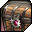
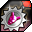
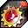

# BOSS Event
---

During the BOSS event, **Dark Devils** from the Dark Demon Realm appear in the world. Defeating them rewards coins, supply crates and exclusive titles.

## Rewards

| Icon | Item | Description |
| - | - | - |
|  | Dark Devil's Silver Coin | Earned by defeating Dark Devils. Exchanged at an NPC for items |
|  | Dark Devil's Gold Coin | Earned by defeating Dark Devils. Exchanged at an NPC for items |
|  | Dark Devil Supply Crate | Loot from a defeated Dark Devil. Its contents are random |

## Title Items

Titles come as items. You must have beaten a Dark Devil to use one.

| Icon | Item |
| - | - |
|  | Dark Devil Silver Coin Title |
|  | Dark Devil Gold Coin Title, one version for each month |
|  | Dark Devil Supply Crate Title |

## Title Effects

| Title | Effect |
| - | - |
| January | Increases Strength by **3** |
| February | Increases Elegant Attack by **2%** |
| March | Increases Focus by **3** |
| April | Increases Dexterity by **3** |
| May | Increases Soul by **3** |
| June | Increases Energy by **3** |
| July | Increases properties by **1** |
| August | Increases Honest Attack by **2%** |
| September | Increases Strange Attack by **2%** |
| October | Increases Wild Attack by **2%** |
| November | Increases Constitution by **3** |
| December | Increases Funny Attack by **2%** |
| Supply Crate (Lucky Box) | Reduce skill cooldown time by **2** |
