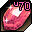

# Upgrading
---

Weapons and armor can be upgraded from **+0** to **+15** with upgrade stones. Each grade raises the attack of a weapon or the defense of an armor piece.

## Stones

| Icon | Stone | Used on | Effect |
| - | - | - | - |
|  | Red Stone | Weapons | +1 grade |
|  | Blue Stone | Armor | +1 grade |
|  | Purple Stone | Weapons | +1, +2 or +3 grades on success |
|  | Green Stone | Armor | +1, +2 or +3 grades on success |
|  | Black Stone (weapon) | Weapons | -1 grade |
|  | Black Stone (armor) | Armor | -1 grade |
|  | White Stone | Both | Protection stone, used together with another stone |

The number on a stone is its level. A stone must match the level range of the item you are upgrading. Stones drop from monsters, come from [TMQs](quests/tmqs.md) and dungeons, and are traded between players.

## Tips

- One of the early tutorial quests asks you to upgrade any item once.
- Upgrade stones sell well on the Auction House, even at low levels.
