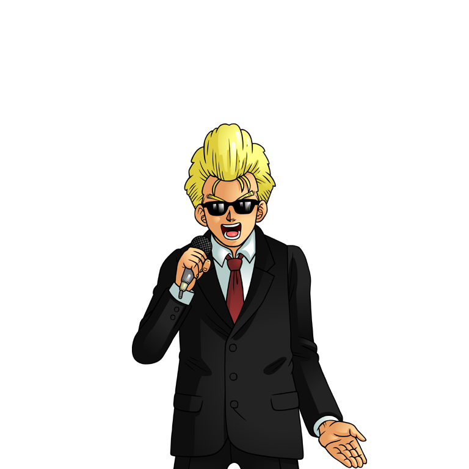

# Ranked Battles & Budokai
---

## Free Battle (Duel)

Any two players can duel in the open world.

- Select a player and send a duel request from the target menu. The fight starts when they accept.
- A referee NPC appears and marks the duel area. Leaving it starts a **10 second** countdown to come back, or you lose.
- The duel ends when one player's LP reaches 0. The loser does not die and is left with 1 LP.

## Ranked Battle

Ranked Battles are arena matches against players of a similar level. They are the main source of **Mudosa Points** and decide who qualifies for the Budokai.

- Talk to the **Ranked Battle Probe** in front of a dojo gate or near the dojo merchants.
- Choose the stage and the mode, then wait in the queue. When an opponent is found a prompt lets you accept or decline, and accepting teleports you to the arena.
- You are matched against players of a similar level.
- Each character can play up to **80** ranked matches per day.

| Mode | Round time | Format |
| - | - | - |
| Individual | 2 minutes | Best of 3 – first to win 2 rounds |
| Team | 3 minutes | Best of 5 – first team to win 3 rounds |

A round is won by reducing the opponent's LP to 0 or by knocking them **out of the ring**. Mudosa Points are awarded at the end of the match, with bonus points for outstanding technique.

## Tenkaichi Budokai (World Martial Arts Tournament)

The tournament is held on a fixed weekly schedule, with separate days for each division. Registration opens automatically: an icon appears at the bottom of the screen when it starts.

| Division | Level |
| - | - |
| Child | 29 and below |
| Adult | 30 and above |

### Format

| Phase | Individual | Party |
| - | - | - |
| Preliminaries | The top **480** applicants by ranking are split into groups of **15**. **32** players advance. | The **75** highest ranked teams of up to 5 players are split into groups of **5** teams. **15** teams advance. |
| Tournament | Single elimination bracket shown on the tournament table | Single elimination bracket |
| Semi-finals | The last four, best of 3 | The last four teams, best of 3 |
| Final | Decides the champion | Decides the champion team |

### Rewards

- Every round played awards **Mudosa Points** and restorative items: **Half Senzu Beans** in the Child Division and **Senzu Beans** in the Adult Division.
- Semi-finalists and finalists receive **ranked points** and decorative **titles**.
- The champions also receive a **Winner Coin** .
- A guild that owns a [dojo](community/guild-and-dojo.md) sends its Guild Master and one chosen member straight into the tournament without preliminaries.

## Spending Mudosa Points

| Where | What you get |
| - | - |
| **Martial Arts Businessmen** | Found around the dojos of the starting villages, West City and major towns. They sell weapons, clothing, accessories, Scouters and props for Mudosa Points only. |
| **AIR Capsule Machine** (Mudosa Gambler) | At least one in every main town. Spend points to receive a random item in an egg capsule. The number on the machine is the item level: a **CL-50** machine gives items for level 50 and above. |
| **Mudosa Village merchants** | Special merchants that only sell to champions |
