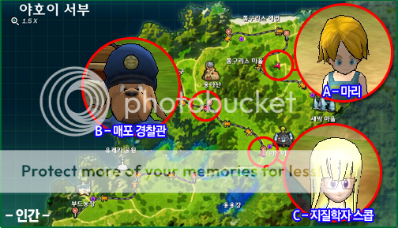
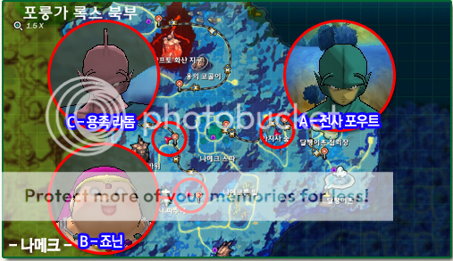
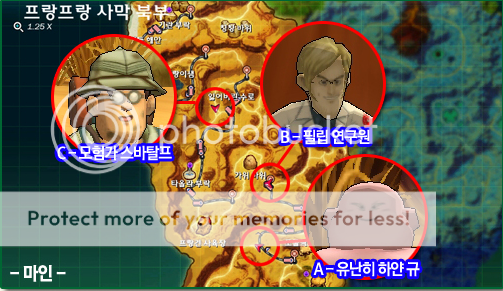

# Time Leap Quests (TLQs)
---

## Locations

### Humans

### Namekians

### Majins

## TLQ1
### Description
You will be teleported to the time when Goku arrives on Earth as an infant, and Dark Eye plans to steal it. You need to get the baby Goku in the ship and take it to Gohan.

But when arriving on the TLQ you have to kill a dinosaur (super easy) and then go see Son Gohan. He will talk with you and then fight you. It is not to win the fight, just hit it right after that conversation and you will see a cutscene of Goku reaching the Earth.

Follow Son Gohan and get the quest with him. Take baby Goku to his grandfather house. He will teach you the Ki Charge.

Upon receiving the quest, hold Z. Shortly thereafter you will see a battle between Goku's grandfather. Do not fight it, use a skill charged with RP. Some balls will appear on the screen, choose the number 1 and done. Will have a last conversation and display Trunks. When you see Trunks, you're done with this first TLQ. Go back to the vortex to return.

### Video
<iframe src="https://www.youtube.com/embed/J0RxNcR6gfw?si=JWhtCUEEPNZf6Gvu" title="YouTube video player" frameborder="0" allow="accelerometer; autoplay; clipboard-write; encrypted-media; gyroscope; picture-in-picture; web-share" referrerpolicy="strict-origin-when-cross-origin" allowfullscreen></iframe>

## TLQ2
### Description
In this second TLQ, you will be teleported to the time when the Ox King's Castle (Gyumao King) is on fire. Walking around there appears an ax on the wall and a conversation with him. Fight him and then appear Kid Goku flying in the cloud. You will have a 'boring' conversation and then you will have to look for ChiChi. Follow the path to find ChiChi on the floor with a''dinosaur''attacking her. Defeat him and talk to ChiChi.

**NOTE:** You will have to beat 3 or 4 Dinosaurs.

After defeating them, talk to ChiChi and you'll have to fight her. Win the fight and will appear Kid Goku. More boring "conversation'' will appear and you will see ChiChi''leaving''with Goku flying in the cloud. Go back to the Ox King, he will give the Block Skill. The quest, use R to stand in front of the Ox King. After that, he will talk to you and a message of Trunks. Return to the Vortex.
Congratulations, you learned how to defend.

### Video
<iframe src="https://www.youtube.com/embed/TqW__6Szw54?si=EnuSb4Vmb3SYBIF-" title="YouTube video player" frameborder="0" allow="accelerometer; autoplay; clipboard-write; encrypted-media; gyroscope; picture-in-picture; web-share" referrerpolicy="strict-origin-when-cross-origin" allowfullscreen></iframe>

### TLQ3
### Description
On this final TLQ, you will appear at the time of World Martial Arts Tournament, where Goku fought Piccolo. You have to help find Goku for Chichi, but before you may struggle with''2''pickpockets, nothing too difficult. Defeat them and go talk to some people (should be marked on the map.) to see if they know Goku.

After talking to the people marked on the map, check out from behind a bush and you'll see Goku. Take him to ChiChi who reveals that he is not Goku, but Oolong. ChiChi will be nervous and will run away. Go after her and talk to her. You will then see a boar and two pickpockets you defeated earlier. You have to fight with the 3! Don't worry, ChiChi will fight alongside you and the 3 guys are easy.

After that, follow ChiChi to where the participants are at World Martial Arts Tournament and will have a mini cutscene with the appearance of Piccolo and a chat with the flat of ChiChi Goku. After that, she will get mad at Goku 'cause Goku do not recognized her and will run to the outside of the site. Talk to her to get the quest from DASH. When you pick up, use the DASH using W twice in front of ChiChi. Then you have completed the TLQ will appear a message of Trunks. Back to the Vortex.

### Video
<iframe src="https://www.youtube.com/embed/u85WOCo5mJ4?si=4FncD3lk6FPD3Njv" title="YouTube video player" frameborder="0" allow="accelerometer; autoplay; clipboard-write; encrypted-media; gyroscope; picture-in-picture; web-share" referrerpolicy="strict-origin-when-cross-origin" allowfullscreen></iframe>